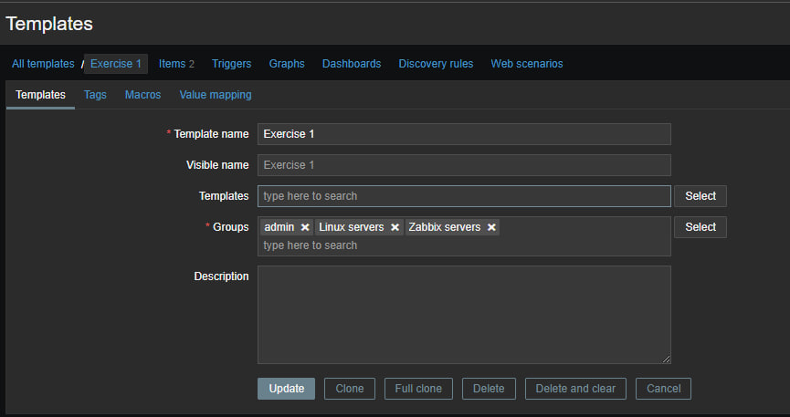
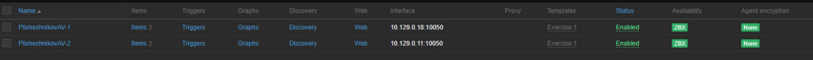
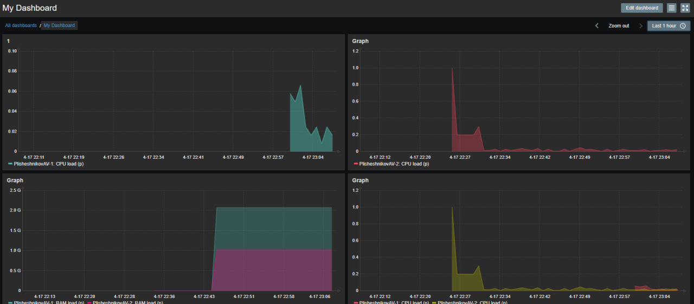

# Домашнее задание к занятию "`Система мониторинга Zabbix. Часть 2`" - `Плишешников Алексей`

### Задание 1

Создайте свой шаблон, в котором будут элементы данных, мониторящие загрузку CPU и RAM хоста.

Прикрепите в файл README.md скриншот страницы шаблона с названием «Задание 1»

---

### Задание 2

Добавьте в Zabbix два хоста и задайте им имена <фамилия и инициалы-1> и <фамилия и инициалы-2>. Например: ivanovii-1 и ivanovii-2 

Результат данного задания сдавайте вместе с заданием 3

---

### Задание 3

Привяжите созданный шаблон к двум хостам. Также привяжите к обоим хостам шаблон Linux by Zabbix Agent.

Прикрепите в файл README.md скриншот страницы хостов, где будут видны привязки шаблонов с названиями «Задание 2-3». Хосты должны иметь зелёный статус подключения

---

### Задание 4

Создайте свой кастомный дашборд.

Прикрепите в файл README.md скриншот дашборда с названием «Задание 4»

---